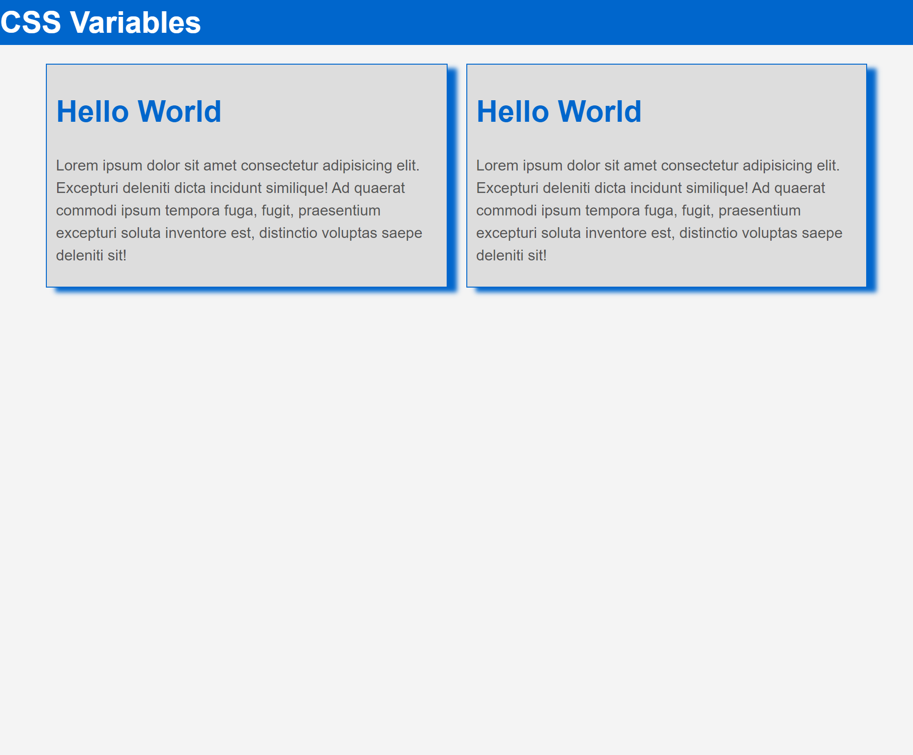

# CSS Variables (Custom Properties) Deep Dive

### About

This project dives deep into CSS variables, or CSS custom properties. CSS3 now offers dynamic values without the use of a CSS pre-processor like SASS or LESS.

### Acknowledgement

Thanks to Traversy Media for another great tutorial!
